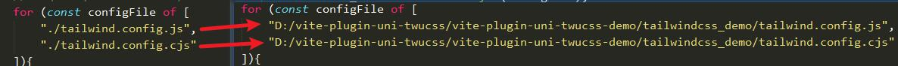

# 注意
一、 如何使tailwind.config.js生效？

	1.因为demo配置的unocss，所以先把vite.config.js有关unocss的代码注释掉,并取消注释require('tailwindcss')(),其他有引入unocss的也要注释掉
	2.修改tailwind包的源代码， 在node_modules\tailwindcss里全局搜索./tailwind.config.js,把它改成绝对路径
